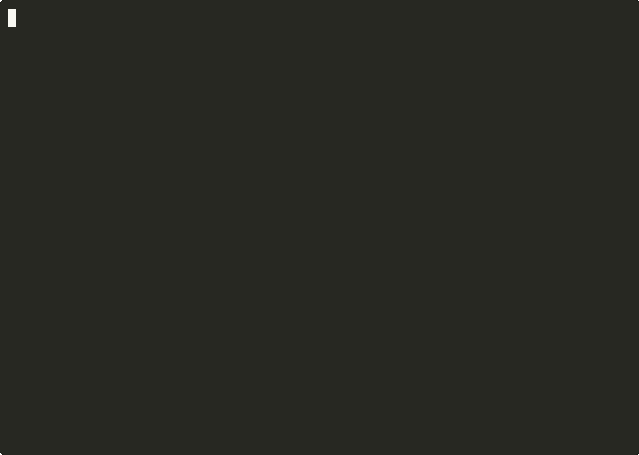

# weft

**Deterministic workflow tracking for Claude Code — smart skills, template management, dashboard auto-refresh.**


Weft turns ad-hoc agent sessions into auditable, event-sourced workflows. Define a template (plan → implement → verify, or an 11-step ticket-to-PR cycle), and weft enforces the order, blocks tools that violate the current step's guards, and refuses to let you `Stop` with steps still pending.

## Why this exists

Multi-step engineering work needs structure that survives compaction, retries, and the agent forgetting what step it's on. Weft solves three problems:

- **Skills fire reliably** — `/wf-start`, `/wf-step`, `/wf-status` read state from disk, not memory.
- **Templates apply consistently** — workflows live in JSON, version-controlled with your project.
- **Hooks enforce the contract** — `PreToolUse`, `PreCompact`, and `Stop` block out-of-order actions or premature exits.

State is an append-only event log under `.claude/weft/`, so every workflow is fully reconstructible.

### Why not just use TODOs or Claude's task list?

Built-in TODOs and ad-hoc checklists live in the agent's context window. They're advisory — the model can ignore them, lose them across compaction, or skip steps it judges unnecessary. They have no enforcement, no replay, no per-step guards. Weft is the opposite tradeoff: a small contract written to disk, enforced by hooks, with an event log you can audit after the fact. Use TODOs when "the model probably remembers" is good enough. Use weft when it isn't.

## Requirements

- **Python 3.10+** (stdlib only — no runtime dependencies)
- **Claude Code** with plugin support
- **macOS or Linux** (the dashboard uses `curses`; Windows is untested)

## Quick Start

Weft ships as a Claude Code plugin. Install via the marketplace:

```
/plugin marketplace add dioptx/weft
/plugin install weft@dioptx-weft
```

Or, for development / hacking on weft itself:

```bash
git clone https://github.com/dioptx/weft.git
claude --plugin-dir ./weft
```

The plugin auto-registers four hooks (`SessionStart`, `PreToolUse`, `PreCompact`, `Stop`) and 11 skills via `.claude-plugin/plugin.json` and `hooks/hooks.json`. Restart Claude Code and the `/wf-*` commands become available.

### First workflow

```
/wf-start generic        # plan → implement → verify
/wf-status               # show current state
/wf-step complete        # advance to the next step
/wf-analyze              # per-template timing + recurring friction across runs
```

Run `/wf-start` with no args for the guided template picker.


See [docs/demo.md](docs/demo.md) for an annotated end-to-end walkthrough, and [docs/demos/](docs/demos/) for the asciicasts and recording scripts behind every GIF in this README.

## Compose your own workflow

Templates are JSON. You can author one inline and pipe it to `weft save-template` — no editor required, no scaffolder. The template lands in `.claude/weft/templates/` and is immediately available to `weft start`.



```bash
cat > flow.json << 'EOF'
{
  "name": "site-audit",
  "steps": [
    {"name": "crawl",  "skill": "/perplexity"},
    {"name": "review", "skill": "/staff-review",
     "guards": [{"command_pattern": "git push", "message": "no push during review"}]},
    {"name": "fix",    "skill": "/fix-polish"},
    {"name": "verify", "loop_back_to": "review", "max_iterations": 3,
     "exit_condition": "no high-severity findings"}
  ]
}
EOF
weft save-template < flow.json
weft start site-audit
```

For interactive composition based on what's in your current conversation, use `/wf-compose`.

## Extend with your own skills

Weft consumes Claude Code skills (`SKILL.md` files under `.claude/skills/`) as workflow steps. Drop a new skill in, reference it from a template via `skill: /<name>`, and weft picks it up.


```bash
mkdir -p .claude/skills/site-audit
cat > .claude/skills/site-audit/SKILL.md << 'EOF'
---
name: site-audit
description: Crawl + audit a target site with lighthouse
allowed-tools: [Bash, Read]
---
# Site Audit
Run lighthouse against $URL, report findings.
EOF

cat <<'JSON' | weft save-template
{
  "name": "audit-cycle",
  "steps": [
    {"name": "audit", "skill": "/site-audit"},
    {"name": "fix",   "skill": "/fix-polish"}
  ]
}
JSON
```

## Features

- **Event-sourced state machine** — append-only JSON log; rebuild state with `/wf-rebuild`
- **Template system** — `generic` (3 steps) and `feature-workflow` (11 steps) bundled; add your own under `templates/` (project), `~/.weft/templates/` (user-global), or `WEFT_USER_TEMPLATES_DIR`
- **Smart skills** — 12 slash commands (`wf-start`, `wf-step`, `wf-status`, `wf-resume`, `wf-run-step`, `wf-abort`, `wf-preview`, `wf-rebuild`, `wf-analyze`, `wf-template`, `wf-compose`, `ev-query`)
- **Guard engine** — per-step `allowed-tools` and `blocked-commands` enforced via `PreToolUse` hook
- **Stop gate** — refuses session exit while steps are incomplete (configurable via `on_fail: block|retry|skip`)
- **Compaction-safe** — `PreCompact` hook writes a `context.md` projection so the next session resumes mid-workflow
- **Live dashboard** — auto-refreshing TUI for monitoring active workflows
- **Template management** — `/wf-template` for creating and editing templates in-session

## Auditable by design

Every workflow transition is an append-only event in `.claude/weft/events.jsonl`. The `state.json` snapshot is just a projection — delete it and weft will rebuild it from events alone.


```bash
weft query                       # human-readable timeline
tail -3 .claude/weft/events.jsonl  # raw structured events
rm .claude/weft/state.json       # nuke the snapshot
weft rebuild                     # reconstruct from events alone
```

Use `weft query --type wf.step_changed`, `--last 50`, or `--workflow <id>` to filter.

## Interactive TUI

For watching multiple workflows at once, `scripts/wf.py` is a curses-based TUI over the same state. Three views: list (every running workflow + PR/CI status), detail (per-workflow step + recent events), templates (discovery).

```bash
python3 $WEFT_ROOT/scripts/wf.py                 # interactive TUI
python3 $WEFT_ROOT/scripts/wf.py --list          # plain-text table (auto when not TTY)
python3 $WEFT_ROOT/scripts/wf.py --json | jq     # machine-readable
python3 $WEFT_ROOT/scripts/wf.py --templates     # template catalog
```

Keys in the list view: `j`/`k` navigate, `enter` open detail, `t` templates, `r` refresh, `q` quit. Detail view: `esc`/`h` back, `r` refresh, `q` quit. Read-only — never mutates weft state.

The TUI scans the current directory by default; pass a path to scan elsewhere. It picks up both legacy single-workflow layouts (`<project>/.claude/weft/`) and per-ticket layouts (`<project>/.claude/weft/workflows/<id>/.claude/weft/`).

For scripting without curses, `scripts/wf-monitor.py` produces the same aligned-table output and supports `--json`, `--templates`, and an explicit project path argument.

Suggested shell alias:

```bash
alias wf='python3 ~/.claude/plugins/cache/local/weft/0.3.0/scripts/wf.py'
```

## Repository Layout

```
.claude-plugin/   plugin.json — Claude Code plugin manifest
core/             Python event store, state machine, projections, CLI, dashboard
hooks/            SessionStart / PreToolUse / PreCompact / Stop bash hooks + hooks.json
skills/           11 SKILL.md files for the /wf-* and /ev-* slash commands
scripts/          wf.py (curses TUI) + wf-monitor.py (plain-text + JSON viewer)
templates/        generic.json, feature-workflow.json (workflow definitions)
tests/            pytest suite covering event store, state machine, hooks, CLI, behaviors
```

The Python core is dependency-free (stdlib only). The dashboard uses `curses`. Tests use `pytest`.

## Custom templates

Weft discovers templates from three locations, in order of precedence:

| Tier | Path | Use for |
|---|---|---|
| Project-local | `<repo>/.claude/weft/templates/*.json` | Templates specific to one project, version-controlled with it |
| User-global | `~/.weft/templates/*.json` (override with `WEFT_USER_TEMPLATES_DIR`) | Personal templates available across every project |
| Bundled | `templates/*.json` inside the plugin | Defaults shipped with weft |

Same-named template higher in the table overrides lower tiers, so you can shadow a bundled template with a project-specific variant.

## Version

**v0.3.0** — current. See [CHANGELOG.md](CHANGELOG.md) for release history.

## Contributing

See [CONTRIBUTING.md](CONTRIBUTING.md) for how to run tests, add templates, and propose changes.

## License

[MIT](LICENSE) © dioptx
